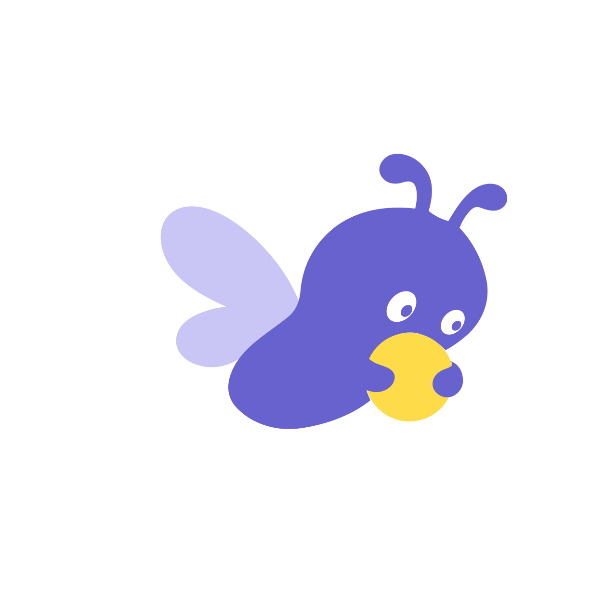

<div align="center">
  
  <h1>Soft Syntax</h1>
  <p><em>為數位產品打造更溫和的語法。</em></p>
  <p><a href="https://catwithlover.github.io/soft-syntax/zh-TW/"><strong>Website</strong></a></p>
  <p><a href="README.md">English</a> · <strong>繁體中文</strong></p>
</div>

**Soft Syntax** 是一套可重複使用的設計 skill，以親和極簡、克制的童趣、溫暖字體與柔和扁平圖像，打造清楚、無障礙且能適應不同螢幕的介面。

## 功能

- 建立新介面、重新設計既有產品、審查設計或規劃實作。
- 為原創 Logo 與插畫制定視覺方向；宿主環境提供相容工具時，也能直接生成圖像。

## 設計原則

- **清楚優先：** 每個頁面只有一個主要操作，資訊層級清楚易讀。
- **以結構創造溫度：** 親切的文字、字體、間距與引導，比裝飾更重要。
- **讓趣味服務於目的：** 趣味用來激發好奇、帶來安心感、鼓勵探索或呈現進度。
- **扁平，但不呆板：** 運用實心形狀、同色系表面、邊界與留白建立層次，不依賴裝飾效果。
- **具體，而非模板化：** 讓成果從產品、受眾與內容建立自己的識別。
- **預設無障礙：** 互動、響應式版面與清楚的狀態提示，都是視覺系統的一部分。

## 安裝

使用 Skills CLI 安裝：

```bash
npx skills add catwithlover/soft-syntax
```

或為偏好的 Agent Skills 相容工具手動安裝：

```bash
git clone https://github.com/catwithlover/soft-syntax.git
cp -r soft-syntax/skills/soft-syntax /path/to/your/agent/skills/
```

安裝後請重新載入或啟動 agent 工具，讓它偵測到這個 skill。

## 使用方式

安裝 [`skills/soft-syntax`](skills/soft-syntax) 後，以自然語言說明產品、受眾、頁面目標與預期成果：

```text
為初次學習程式設計的成人設計一個響應式課程探索頁面。讓使用者能輕鬆
比較課程、依主題與難度篩選，並知道該從哪裡開始。整體體驗應平靜、親切，
且具有鼓勵性。
```

## 改造示範

[`demos/`](demos/) 目錄收集以本 skill 改造真實網站的前後對照截圖——目前收錄 [Selenium 首頁](demos/selenium/)、[ModSecurity 首頁](demos/modsecurity/)與[全國動物收容管理系統收容公告](demos/pet/)，並記錄每個成果的策略、配色依據與設計決策。

## 圖像生成

如果宿主 harness 或模型 runtime 提供圖像生成工具，Soft Syntax 會依照內含的[插畫規範](skills/soft-syntax/references/illustration-language.md)引導生成結果。請說明產品用途、Logo 要傳達的概念及使用情境，不要要求模仿既有 Logo。

```text
使用 Soft Syntax 為 [專案名稱] 設計並生成一個不含文字的圖像標誌。
產品協助 [目標使用者] 達成 [成果]。Logo 要傳達 [一個核心概念]。
請選擇一個能讓人立刻理解這項概念的主體。

採用 Soft Solid Semantic Imagery（柔和實心語意圖像）風格：以一個柔和
圓潤的主要剪影為主，只保留辨識主體所需的細節；使用少量且符合情境的色彩、
充足留白，以及一個明確焦點。運用實色、留白與圖形重疊建立形體。
避免漸層、陰影、外框、裝飾性場景、文字，以及彼此競爭的多重隱喻。

請先遵守指定格式。如果需要可編輯的 SVG，請用原始碼編輯工具直接製作原生
SVG；其他格式則在環境提供相容圖像生成工具時，於透明的正方形畫布上生成。
若兩種方式都無法產出指定成果，請提供可直接使用的圖像提示詞與 SVG 建構計畫。
```

同樣的方法也適用於角色、空狀態、主視覺與產品隱喻。

## 視覺語言

Soft Syntax 結合三個層次：

1. **親和極簡**以克制、實用的結構建立清楚層級。
2. **溫和童趣**加入恰到好處的好奇心、溫度與生命力。
3. **柔和扁平設計**運用字體、實心形狀、低調的表面層次與有意義的圖像。

製作原創圖像時，Soft Solid Semantic Imagery 只使用一個主要剪影、足以辨識主體的細節、有限的配色，以及一個有意義的焦點。它適用於生物、植物、自然形體、天體、物件與抽象產品隱喻，不必把每張圖都做成吉祥物。

## 需求

- 用於完整檢查視覺呈現的瀏覽器或螢幕截圖工具
- 直接生成圖像時，由宿主 harness 或模型 runtime 提供的圖像生成工具

## 授權

Soft Syntax 的原始碼、文件與 Logo 採用 [MIT License](LICENSE)。隨附的 Quicksand 與 Huninn 保留各自的上游授權；詳細資料位於 [`skills/soft-syntax/assets/fonts`](skills/soft-syntax/assets/fonts)。
